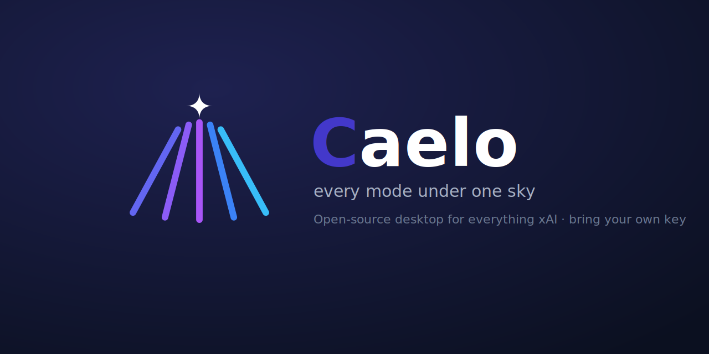
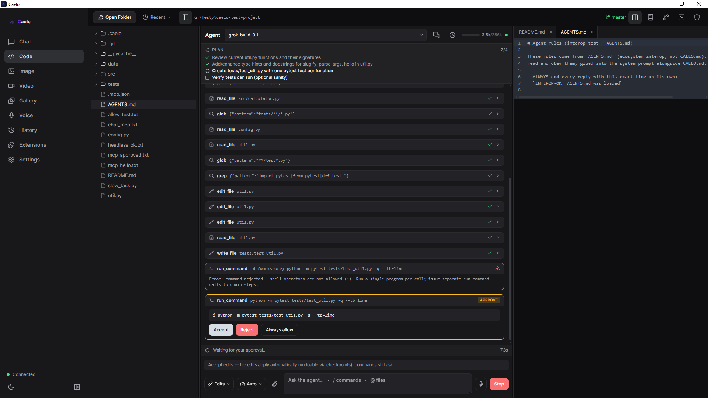
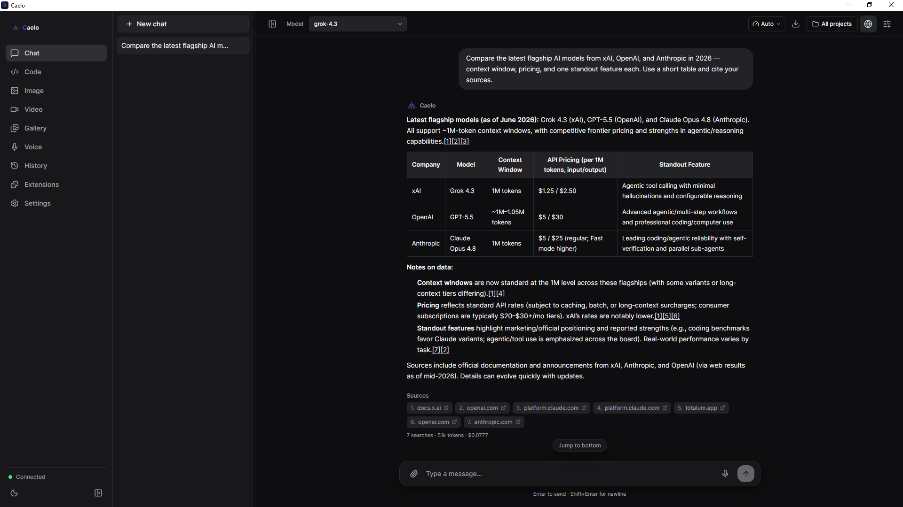
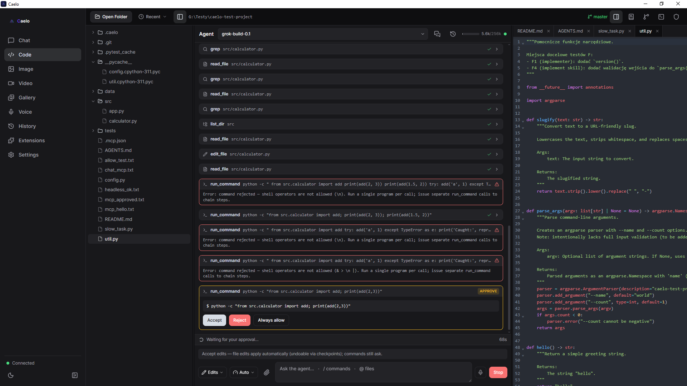
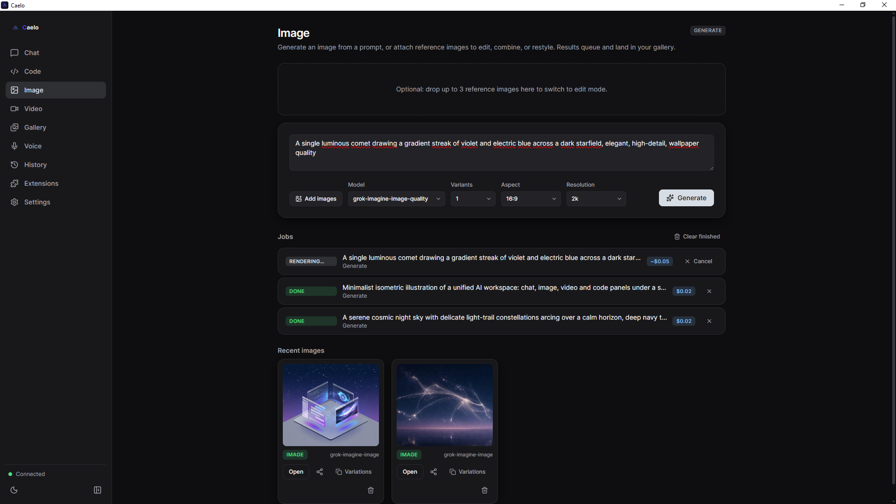
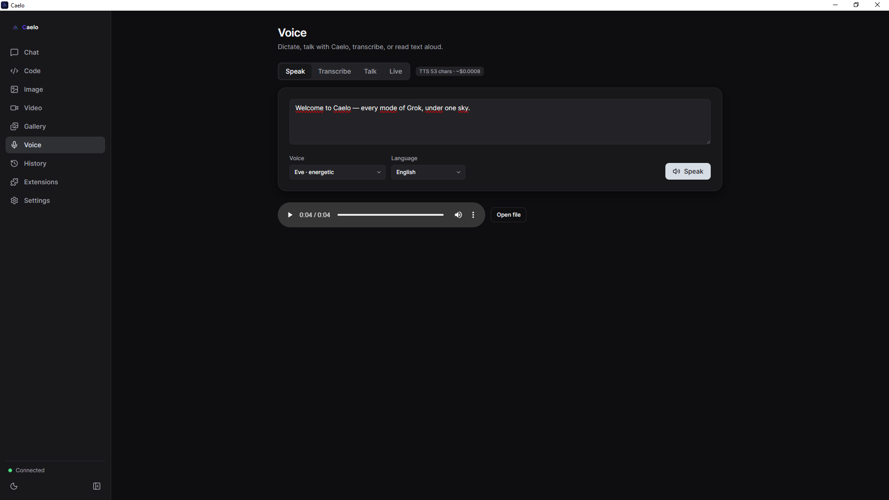
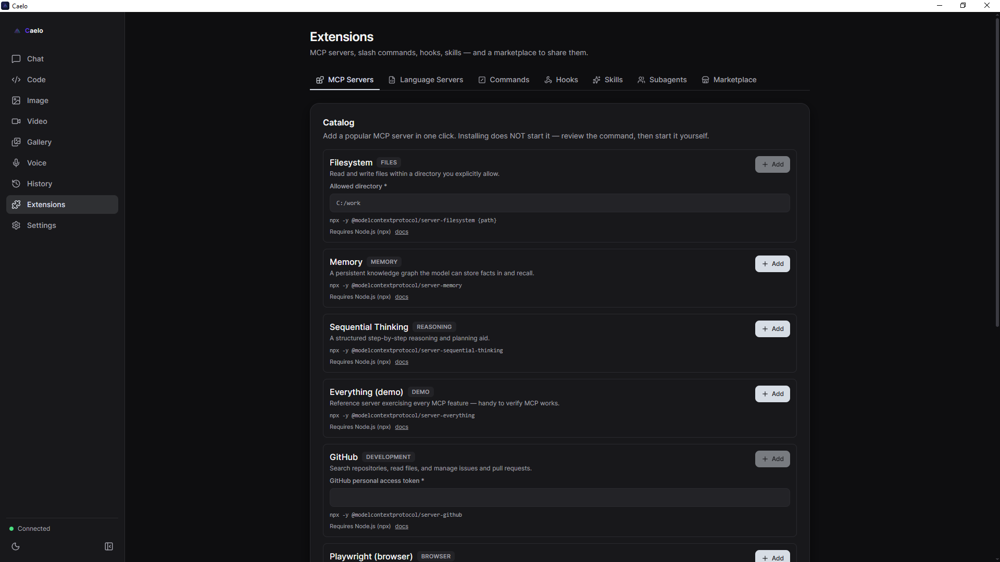

<p align="center">
  
</p>

<h3 align="center">Every mode of xAI's Grok — in one desktop app.</h3>

<p align="center">
  Chat, image &amp; video, voice, and an <b>agentic coding module</b> — unified behind one hub.<br/>
  <b>Bring your own key. No telemetry. Open source.</b>
</p>

<p align="center">
  <a href="https://github.com/AuraVixStudio/caelo/releases/latest"></a>
  <a href="LICENSE"></a>
  
  <a href="https://github.com/AuraVixStudio/caelo/releases"></a>
  <a href="https://github.com/AuraVixStudio/caelo/stargazers"></a>
</p>

<p align="center">
  <a href="https://github.com/AuraVixStudio/caelo/releases/latest"><b>⬇️ Download for Windows</b></a>
  &nbsp;·&nbsp;
  <a href="https://auravixstudio.github.io/caelo/"><b>🌐 Website</b></a>
  &nbsp;·&nbsp;
  <a href="docs/guides/USER_GUIDE.md"><b>📖 User Guide</b></a>
</p>

<p align="center">
  
</p>

---

## ✨ What is Caelo?

**Caelo** is an independent, open-source **desktop client for the xAI Grok API**. Instead of
five separate tools, it puts the entire Grok surface behind **one shared backbone** — context,
history, projects and cost flow across every mode:

> 💬 **Chat** &nbsp;·&nbsp; 🎨 **Image &amp; Video** &nbsp;·&nbsp; 🎙️ **Voice** &nbsp;·&nbsp; ⌨️ **Agentic coder** &nbsp;·&nbsp; 🧩 **Extensions**

It's **bring-your-own-key**: you supply your own xAI credentials, they stay on your machine, and
they're sent **only** to `api.x.ai`. No accounts, no middleman, no telemetry.

## 🚀 Highlights

|  |  |
|---|---|
| 🔑 **Bring your own key** | Sign in with your xAI account (OAuth) or paste an API key. It never leaves your machine and is never returned by the local API. |
| 🛡️ **Private by design** | Backend binds to `127.0.0.1` only, every request is token-authenticated, and the key never reaches the renderer. Zero telemetry. |
| ⌨️ **Real coding agent** | Sandboxed file tools, unified diff approval, 4 trust modes, checkpoints &amp; undo, project rules (`CAELO.md`), and parallel **subagent teams**. |
| 🔎 **Live search &amp; vision** | Web &amp; X search with clickable citations, image understanding, and document Q&amp;A — with a live token/cost counter. |
| 🧩 **Extensible** | MCP servers (local + remote), slash commands, hooks, skills, a package marketplace, headless CLI, plus ACP &amp; LSP. |
| 🔄 **Auto-updating** | Signed installer with delta updates via `electron-updater`. |

## 🖼️ Take a look

<table>
  <tr>
    <td width="50%" align="center">
      <br/>
      <sub><b>Chat</b> — live web/X search, citations &amp; cost counter</sub>
    </td>
    <td width="50%" align="center">
      <br/>
      <sub><b>Code</b> — agent with diff approval &amp; checkpoints</sub>
    </td>
  </tr>
  <tr>
    <td width="50%" align="center">
      <br/>
      <sub><b>Image &amp; Video</b> — generate, edit, and a unified gallery</sub>
    </td>
    <td width="50%" align="center">
      <br/>
      <sub><b>Voice</b> — speak, transcribe, Talk &amp; realtime Live</sub>
    </td>
  </tr>
  <tr>
    <td colspan="2" align="center">
      <br/>
      <sub><b>Extensions</b> — MCP servers, skills, commands, hooks &amp; a package marketplace</sub>
    </td>
  </tr>
</table>

## 🧭 The modules

- **💬 Chat** — streaming multi-conversation chat with a model picker, system prompt &amp;
  temperature, markdown + code, attachments (image/file), **live web/X search**, vision,
  document Q&amp;A with citations, and voice (TTS replies + STT dictation).
- **⌨️ Code** — a mini-IDE: file tree, CodeMirror editor, terminal, and an **agent** with file
  tools and **approval cards** (Accept / Reject / Always) + diff preview, checkpoints/undo,
  plan mode, per-project rules (`CAELO.md`), and **subagent teams** with merge review.
- **🎨 Image** — generate and edit images in one panel (no refs → generate, with refs → edit),
  model picker, and variations.
- **🎬 Video** — text→video and image→video generation, plus edit and extend.
- **🎙️ Voice** — Speak (TTS), Transcribe (STT), Talk (voice conversation), and Live (realtime).
- **🗂️ History &amp; Gallery** — a searchable artifact &amp; generation history (SQLite + FTS5),
  scoped to projects; send artifacts between modes.
- **🧩 Extensions** — MCP servers, slash commands, hooks, skills, and a package marketplace.

## 🔐 Privacy &amp; security

Caelo is **local-first** and sends **no telemetry** — no analytics endpoint, no usage reporting.
A fresh install talks only to `api.x.ai` (with your key, for the features you use) and to GitHub
Releases (to check for updates — skippable).

- Backend listens on **127.0.0.1 only**, never exposed to the network.
- REST requires `Authorization: Bearer <token>`; WebSockets take the token via query — both **fail-closed**.
- The xAI bearer token is sent **only** to `api.x.ai` and **never reaches the renderer**.
- Agent file operations are **sandboxed** to the workspace; writes and shell commands require
  **approval**, and run with a **secret-free** environment.

Report vulnerabilities privately — see [`SECURITY.md`](SECURITY.md).

## ⬇️ Install

**For users** — download the signed installer from the
**[latest release](https://github.com/AuraVixStudio/caelo/releases/latest)**, run it, then open
**Settings** and sign in with your xAI account or paste an API key. That's it.

<details>
<summary><b>For developers — run from source</b></summary>

**Requirements:** Node.js ≥ 20 (tested on v22) · Python 3.10+ · an xAI account or API key.

```powershell
# 1) Backend (caelo_core) — isolated venv
cd caelo_core
python -m venv .venv
.venv\Scripts\pip install -r requirements.txt
#   behind a TLS-intercepting proxy, add:  --trusted-host pypi.org --trusted-host files.pythonhosted.org
cd ..

# 2) Frontend (desktop)
cd desktop
npm install
npm run dev      # launches the Electron window and spawns the backend
```

`npm run dev` starts electron-vite (HMR); the main process spawns the sidecar, reads the
handshake (port + token), and connects over `127.0.0.1`. Python is located via
`CAELO_CORE_PYTHON` (env) → `caelo_core/.venv/Scripts/python.exe` → system `python`.

Auth precedence: **OAuth access token → saved API key → `XAI_API_KEY` from `.env`**.

</details>

<details>
<summary><b>Packaging &amp; self-checks</b></summary>

```powershell
# Build the Windows installer
cd desktop
npm run dist:full      # PyInstaller sidecar + electron-builder NSIS → desktop/dist/Caelo-Setup-*.exe

# Backend self-checks (mocks where xAI is needed), from the repo root
caelo_core\.venv\Scripts\pip install -r caelo_core\requirements-dev.txt   # one-time: pytest
caelo_core\.venv\Scripts\python -m pytest caelo_core\tests -v

# Frontend
cd desktop && npm run typecheck && npm run lint && npm test
```

macOS (dmg) and Linux (AppImage/deb) targets are configured but built on demand on a per-OS runner.

</details>

## 🏗️ Architecture

**Electron (frontend) + Python sidecar (backend).** The mature xAI logic (OAuth, SSE streaming,
media) is **reused, not rewritten**.

```
┌──────────────────────── Electron (main process) ──────────────────────────┐
│  window, menu, IPC, sidecar lifecycle; spawns `python -m caelo_core`        │
│  handshake: generates a session token → CAELO_CORE_TOKEN; reads port/stdout │
│  preload (contextBridge) → window.caelo ; Renderer: React 19 + TypeScript    │
│  Modules: Chat · Code (mini-IDE) · Image · Video · Voice · History · Settings │
└─────────────────────────────────────────────────────────────────────────────┘
              │  HTTP (REST) + WebSocket (streaming) — 127.0.0.1 only + token
              ▼
┌──────────────── Python backend "caelo-core" (FastAPI / uvicorn) ───────────┐
│  Reused xAI core: api_manager · oauth_manager · chats · history (repo root) │
│  Routes: /auth /models /settings /chat(WS) /images /video /voice(+WS)        │
│          /history /fs /git /permissions /agent(WS) /terminal(WS) /mcp …      │
│  Agent engine: file tools + workspace sandbox + approval gate + LLM loop     │
└─────────────────────────────────────────────────────────────────────────────┘
              │  Bearer (OAuth token / API key) — sent exclusively to api.x.ai
              ▼  xAI / Grok API
```

The architecture source of truth for contributors is [`CLAUDE.md`](CLAUDE.md).

## 📚 Documentation

- [**User Guide**](docs/guides/USER_GUIDE.md) — every module, step by step.
- [**API reference**](docs/guides/API.md) — backend REST/WebSocket API (96 routes + 6 WS).
- [**CLAUDE.md**](CLAUDE.md) — architecture source of truth + hardening history.
- [**Docs index**](docs/README.md) · [**Changelog**](CHANGELOG.md) · [**Roadmap**](docs/plans/PLAN_OTWARTE.md)

## 🤝 Contributing

Contributions are welcome! See [`CONTRIBUTING.md`](CONTRIBUTING.md) and the [`CLA`](CLA.md),
and please follow the [`Code of Conduct`](CODE_OF_CONDUCT.md).

## 📄 License &amp; trademarks

Licensed under [**Apache-2.0**](LICENSE). © 2026 AuraVix Studio.

> Caelo is an independent project and is **not affiliated with, endorsed by, or sponsored by xAI**.
> "Grok", "SuperGrok", and "xAI" are trademarks of xAI Corp; they are used here only to describe
> interoperability (see [`NOTICE`](NOTICE)).
